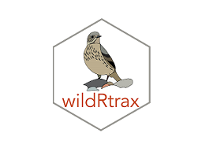

wildRtrax
==========================================================

> Queries, cleaning, analysis, and quality control of data from the WildTrax database in R


```{r setup, include=FALSE}
knitr::opts_chunk$set(echo = TRUE)
```

<br>
<br>
<br>

Overview
-----------

The **wildRtrax** package provides a set of functions to query environmental sensor data from the [WildTrax platform](https://www.wildtrax.ca/home.html), as well as perform basic data cleaning, analysis, and quality control in R. 
