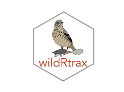

# wildRtrax

> A series of advanced user functions for environmental sensor data management, analytics and exploration. Also serves as an interface for data connectivity between the Boreal Avian Modelling Project, NatureCounts and WildTrax.

<!-- badges: start -->

<!-- badges: end -->

   

## Overview

The **wildRtrax** package provides a set of functions to perform
environmental sensor data management within the open data initiative framework, and fosters the connection of data between [NatureCounts](https://www.birdscanada.org/birdmon/default/main.jsp) the [Boreal Avian Modelling Project](https://borealbirds.ualberta.ca/) and WildTrax [WildTrax](https://www.wildtrax.ca/home.html). Mainly written in R, Python and bash. 

## Issues

To report bugs, request additional features, or get help using the
package, please file an
[issue](https://github.com/mabecker89/wildRtrax/issues). Alternatively,
you can email Alex MacPhail <agmacpha@ualberta.ca> or Marcus Becker
<mabecker@ualberta.ca>

## License

This R package is licensed under [MIT
license](https://github.com/mabecker89/wildRtrax/blob/master/LICENSE) ©
2020 Marcus Becker, Alex MacPhail, and the [ABMI](https://www.abmi.ca/home.html).
